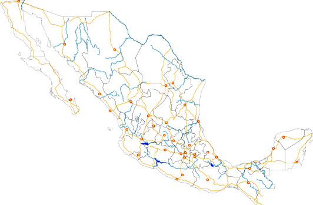
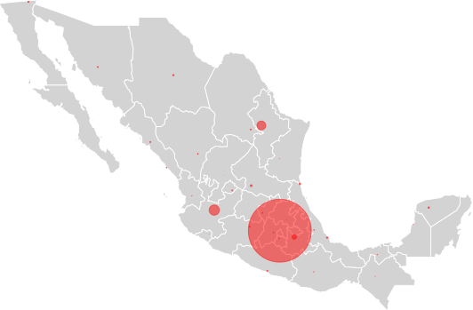
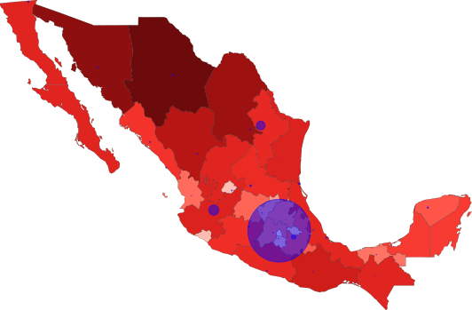
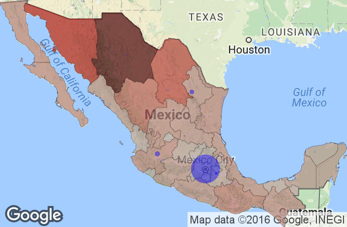

PlotShapefiles.jl
=================

A package to plot shapefiles with Julia.

There are three main functions - with methods described in the demo:
- plotshape() - for plotting all types of shapefiles (e.g. polygons, polylines, points, etc. except currently the Multipatch type)
- choropleth() - for plotting a choropleth with polygon type shapefiles
- google_overlay() - for overlaying the shape plot onto a Google static image from their API.

## Demo / Documentation

A detailed demo describing the functionality and creating the example images below is available:  
1. [here as an html](http://htmlpreview.github.com/?https://github.com/Wedg/PlotShapefiles.jl/blob/master/demo/PlotShapefiles_Demo1.html) file, or  
2. [here as an ipynb file](demo/PlotShapefiles_Demo1.ipynb).

## Examples of outputs.

